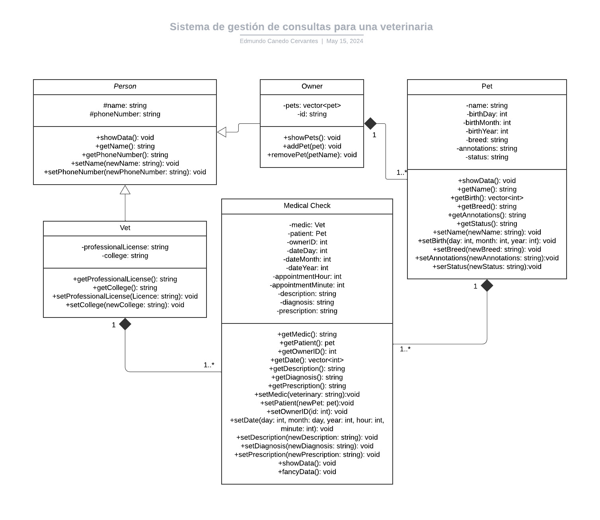

# Pet-Vet-Health
 
Pet Vet Health es un proyecto realizado en la clase TC1030. Trata sobre un sistema gestor para las consultas de una veterinaria, en donde se pueden añadir consultas y guardar su información, para, posteriormente buscarla en caso de ser necesario.

## Correcciones realizadas

 - $\color{red} \text{Identifico los casos que harían que el proyecto deje de funcionar:}$

    Antes no se contaba con un apartado donde se mostraban dichos casos, después de analizarlo, se encontraron casos concretos de este proyecto los cuáles podrían hacer que deje de funcionar. Dichos casos se encuentran en [este apartado](#aspectos-que-pueden-afectar-que-deje-de-funcionar).

 - $\color{red} \text{Genero un diagrama de clases UML correcto y y explico su relación con el problema de forma clara:}$

    Al generar el diagrama UML por primera vez hubo un pequeño error al hacer la clase `MedicalCheck` ya que no se metieron las clases `Owner` y `Vet` como punteros.

    Sin embargo, con el paso de las entregas, se terminó modificando la estructura general de las clases.

    Al final se cuentan con 2 diagramas UML, el [primero(que tiene errores)]("https://github.com/EdCanCe/Pet-Vet-Health/blob/main/Extra/oldUML.jpeg"), y el [nuevo](#diagrama-uml).

 - $\color{red} \text{Herencia, Modificadores de acceso y Sobreescritura}$

   Al momento de la 2da entrega se entregó un programa el cuál no corrió. Para que corriese se ocupaba que estuviese el archivo `database.txt`, sin embargo, dentro del archivo `.gitignore` se englobaron a todos los archivos `.txt`, por esto mismo, dicho archivo no se subió, y, por ende, no se pudo compilar.

   Se eliminaron los archivos `.txt` del `.gitignore`, haciendo así que ya se pudisen subir y pudiese compilar.

   De la misma manera se recomendaron separar las clases (que en ese momento estaban todas dentro del `main.cpp`) para que cada una tuviera su `.h`, por lo que se separaron para que cada clase contara con su propio archivo. Sin embargo, las clases hijas se pusieron dentro del mismo archivo de la clase madre.

## Funcionamiento

Se hizo un programa de gestión de una veterinaria. El mismo permite crear perfiles para veterinarios y dueños, y, dentro del último, poderle añadir sus mascotas.

Con los perfiles hechos, se pueden realizar servicios a dichas mascotas, dentro de éstos está un chequeo médico, una cirugía, el servicio de un baño para la mascota o de un hotel, para que por un tiempo se quede en la veterinaria.

Al final, con los servicios hechos, se pueden imprimir de 2 maneras, una de éstas siendo una impresión simple en consola, mientras que si se busca imprimir dicho servicio como una orden en pdf, se genera un archivo `.html` que se abre automáticamente, se espera que ahí el usuario presione `ctrl`+`p` para que pueda imprimirlo. Se decidió de hacer de esta manera para que no se tuvieran que implementar librerías externas.

Si lo único que se quiere hacer es probar el funcionamiento de clases se recomienda compilar y correr `test.cpp` ya que no ocupa input por parte del usuario. 

Si se quiere ver el funcionamiento real del programa compilar y correr `main.cpp`, ya que es el verdadero programa. Se incluyeron unos pequeños datos dentro de éste para que de igual forma pueda ser probado.

## Diagrama UML

## Aspectos que pueden afectar que deje de funcionar

Al programa se le implementó un sistema en el cual recibe strings de entrada, y luego éstas son convertidas a enteros en caso de ser necesario, por lo mismo, las entradas del usuario no harían que el programa deje de funcionar.

Sin embargo, si al archivo `database.txt` se ve corrompido o no existe, podría hacer que el programa no funcione, ya que al iniciar la ejecución del programa éste mismo trata de abrir dicho archivo para obtener los datos que se le han ido ingresando conforme el paso del tiempo.

## Como correr el programa

En la terminal ubicarse en el directorio de la carpeta.

Se compila igual tanto para linux como para windows, con: `g++ main.cpp`.

Para correr en linux: `./a.out`.

Para correr en windows con cmd: `a.exe`.

Para correr en windows con bash: `./a.exe`.
