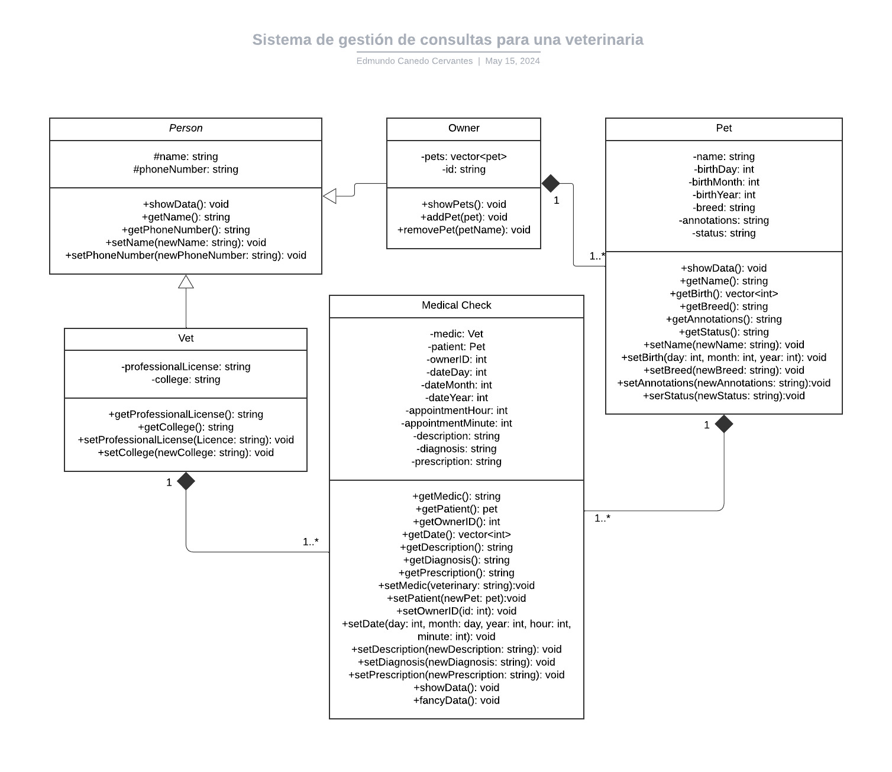

# Pet-Vet-Health
 
Pet Vet Health es un proyecto realizado en la clase TC1030. Trata sobre un sistema gestor para las consultas de una veterinaria, en donde se pueden añadir consultas y guardar su información, para, posteriormente buscarla en caso de ser necesario.

## Funcionamiento
Si lo único que se quiere hacer es probar el funcionamiento de clases se recomienda compilar y correr `test.cpp` ya que no ocupa input por parte del usuario. 

Si se quiere ver el funcionamiento real del programa compilar y correr `main.cpp`, ya que es el verdadero programa. Se incluyeron unos pequeños datos dentro de éste para que de igual forma pueda ser probado.

## Diagrama UML
*No se ha actualizado debido al constante cambio en clases*
La composición de las clases se puede ver en el siguiente diagrama:

## Aspectos que pueden afectar que deje de funcionar
Al programa se le implementó un sistema en el cual recibe strings de entrada, y luego éstas son convertidas a enteros en caso de ser necesario, por lo mismo, las entradas del usuario no harían que el programa deje de funcionar. Sin embargo, si al archivo `database.txt` se ve corrompido podría hacer que el programa no funcione.

## Como correr el programa

En la terminal ubicarse en el directorio de la carpeta.

Se compila igual tanto para linux como para windows, con `g++ main.cpp`.

Para correr en linux `./a.out`.

Para correr en windows cmd `a.exe`.

Para correr en windows bash `./a.exe`.