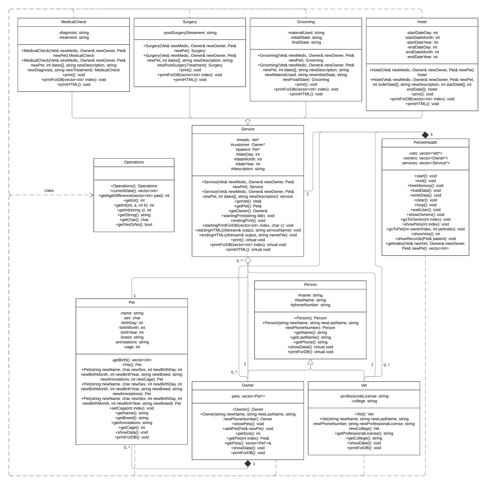
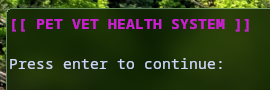
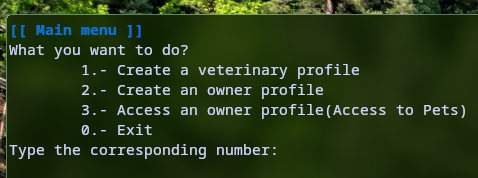
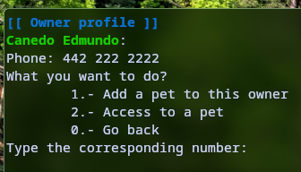
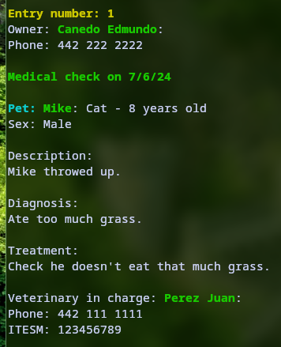
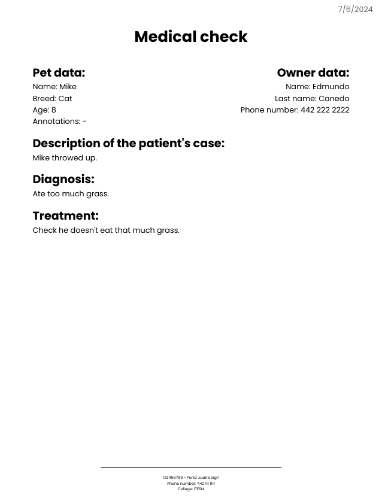

# Pet-Vet-Health 

Pet Vet Health is a project developed in the TC1030 class. It is a management system for veterinary consultations, where consultations and general services can be added, and their information can be saved for future reference if needed. Similarly, it is possible to generate `HTML` files that can be converted to PDF.

## Functionality

A veterinary management program was created that allows the creation of profiles for veterinarians, pet owners and the addition of their pets.

With the profiles created, services can be provided to these pets, including medical check-ups, surgeries, bathing services, or boarding services where the pet can stay at the veterinary clinic for a period of time.

In the end, services can be printed in two ways: one being a simple console print, and the other being printing the service as an order in PDF. This generates an `.html` file that opens automatically, and the `.js` file within will "print" the document. Browsers allow saving as PDF instead of printing, which would generate a PDF. This method was chosen to avoid the need for external libraries and to directly open in the user's browser.

If you only want to test the functionality of classes, it is recommended to compile and run `test.cpp` as it does not require user input.

To see the actual program functioning, compile and run `main.cpp`, as this is the real program. Some sample data is included in this file for testing purposes.

## UML Diagram

## How to Run the Program

In the terminal, navigate to the directory of the folder.

Compile the same way for both Linux and Windows with: `g++ main.cpp`. 

It uses vectors, so if many errors occur, it could be due to the version of `g++` used. In that case, try compiling with `g++ -std=c++17 main.cpp`.

To run on Linux: `./a.out`.

To run on Windows with cmd: `a.exe`.

To run on Windows with bash: `./a.exe`.

For PDF generation, it is recommended to disable the margin function in the print settings of the browser. It is also recommended to enable the background graphics option. The scaling should be left at default.

## Screenshots of the Program Functionality

  

  

  

  

  

